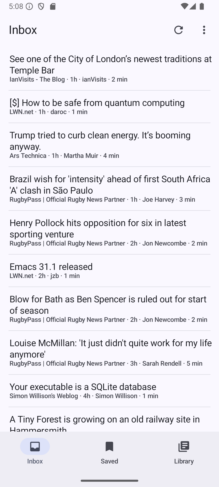
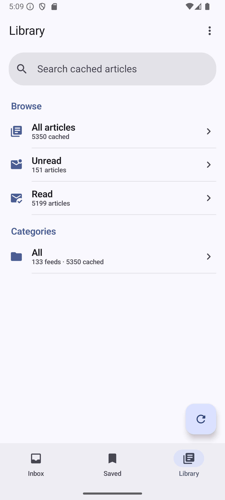
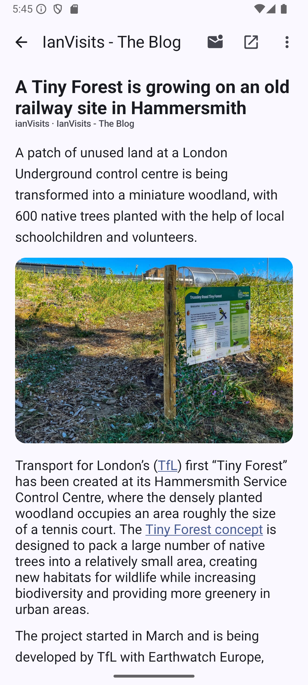

# Brooklet

Brooklet is an opinionated app for reading RSS and Atom feeds using the Miniflux server. It works with Android and it syncs and stores your articles offline if you're not always connected to your server. There's also an extra integration into Karakeep for bookmarking.



Brooklet is primarily maintained for its author's own use. It is free software:
fork it, adapt it, and maintain your own version if it is useful to you. There
is no promise of user support, compatibility, feature work, or response times.
Please read [SECURITY.md](SECURITY.md) before reporting a vulnerability, and
[CONTRIBUTING.md](CONTRIBUTING.md) before opening a non-security issue or pull
request.



Brooklet is licensed under the GNU General Public License, version 3 or later;
see [COPYING](COPYING). The privacy policy is in [PRIVACY.md](PRIVACY.md), and
the release checklist for the Google Play Data Safety form is in
[docs/PLAY_DATA_SAFETY.md](docs/PLAY_DATA_SAFETY.md).
See [PERFORMANCE_TESTING.md](PERFORMANCE_TESTING.md) for the local optimized
release deployment path. This is not currently released on the play store and may not be.



## Security and privacy model

Brooklet requires HTTPS for configured Miniflux and Karakeep services. Their
credentials are encrypted by Android Keystore; cached article text and metadata
remain in the app's local database for offline use. Credential-bearing API
requests do not follow redirects. Article images are transient, HTTPS-only,
redirect-free, and cannot resolve to local/private network addresses.

See [PRIVACY.md](PRIVACY.md) for the full data-handling description. This model
does not protect data from someone who can unlock or compromise the device, or
from a Miniflux/Karakeep server or article site chosen by the user.

## Build

You can build the app using Android Studio or any other Android dev tools. The
phone application is the `app-phone` Gradle module and the independently
packaged Wear OS application is `app-wear`.

```sh
JAVA_HOME=/path/to/jdk-17 \
GRADLE_USER_HOME="$PWD/.gradle-local" \
./gradlew :core-model:test :app-phone:assembleDebug :app-wear:assembleDebug
```

Set `JAVA_HOME` to a local JDK 17 installation; the path above is only an
example. Never commit `local.properties`, signing keys, emulator captures,
logs, or generated `build/` output. These are ignored by the repository and
may contain machine-specific paths or private test data.

Both applications compile and target API 37.1. The phone minimum is API 28;
the watch minimum is API 33 (Wear OS 4). Article images remain network-only on
the phone and are omitted entirely from the watch reader.

## Pixel Watch reader

`app-wear` is a compact offline reader designed around the 41 mm Pixel Watch 2
profile. In release builds, initial setup starts automatically on the watch and
is confirmed from the Set up a watch section in phone Settings.
After that one-time credential transfer, the watch syncs directly with the
configured Miniflux HTTPS server; the phone does not relay article caches or
reading actions.

When both `brooklet.devMinifluxUrl` and `brooklet.devMinifluxToken` are present
in the ignored `local.properties`, the debug Wear build embeds those same local
development values and provisions itself directly. No phone interaction is
required for that debug-only path. Release builds always receive empty
development fields and never package these credentials.

The watch keeps at most 100 ordinary unread entries, 10 recently opened read
entries for 24 hours, and 25 MiB of normalized text bodies. Images are omitted,
useful alt text is retained, and individual bodies are capped at 256 KiB on a
block boundary. Pending read, star, and Miniflux-Karakeep actions are protected
from cache eviction. Search, notifications, complications, feed administration,
and direct Karakeep credentials are intentionally not part of the first Wear
release.

For local performance testing, an optimized release APK can be signed with the debug certificate by adding this ignored setting to `local.properties`:

```properties
brooklet.debugSignRelease=true
```

Build the matching pair with
`./gradlew :app-phone:assembleRelease :app-wear:assembleRelease`. These artifacts
are for local testing only and must not be uploaded to Play.

To run all the development checks Use JDK 17 and a repository-local Gradle cache:

```sh
JAVA_HOME=/path/to/jdk-17 \
GRADLE_USER_HOME="$PWD/.gradle-local" \
./gradlew :core-model:test :core-network:test :core-sync:test \
  :app-phone:testDebugUnitTest :app-wear:testDebugUnitTest lintDebug \
  :app-phone:assembleDebug :app-wear:assembleDebug
```

For the release rehearsal, follow [docs/release.md](docs/release.md). Do not commit generated artifacts, local configuration, signing keys, captures, or logs.

### CI APKs

The Android checks workflow builds every pull request and every commit pushed
to `main`. After all checks pass, its run summary contains a 14-day
`brooklet-debug-<commit>` artifact with an installable, debug-signed APK. The
workflow can also be run manually for any branch from GitHub's Actions tab.
GitHub does not run workflows for arbitrary commits that have not been pushed.

Treat CI APKs as short-lived test builds: they use the debug application ID and
debug signing certificate, are not optimized release binaries, and must not be
published to an app store. A contributor from a fork cannot obtain repository
secrets through this pull-request workflow.
